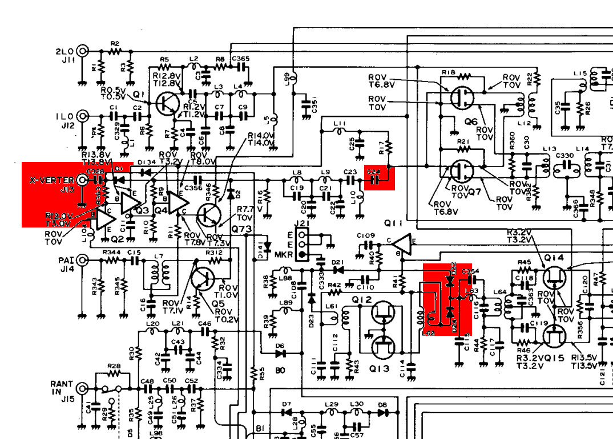

# icom
using Red Pitaya with IC-735

IC-735 modifications for use with Red Pitaya

All modifications were done in a way, that the transceiver can be 
reworked to the original status. All components will stay inside the 
unit and no drilling holes are required. For the connections to the 
Red Pitaya existing connectors will be used. 

J13 (X-Verter) for Rx-Out and 
J18 (ALC) for Tx-In 

After modification the receiver works as usual - the transmitter is 
diconnected.

Required Material: RG-174 (0.5m), some solder pins 

Rx Path:
C328 (4.7nF) - solder out side which is connected to R363 and connect
open side with small coax cable to cathode of D24. Solder shield of coax
cable on both sides close to GND (GND of J13 and sheet metal close to 
D24).  

#### J13

Tx Path:
R359 (10k) - solder out side which is connected to J18 and 
connect open end with small wire (W30) to J6. Now the ALC connector (J18) 
is available for TX-In. C24 solder out side which is connected to small
bridge and connect open end with small coax cable to ALC-connector (J18).
Solder shield of coax cable on both sides close to GND (GND of J18 and
screw close C24).  

